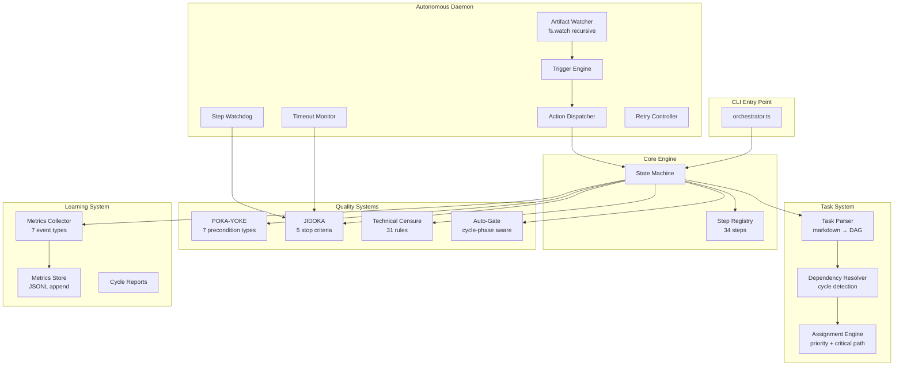
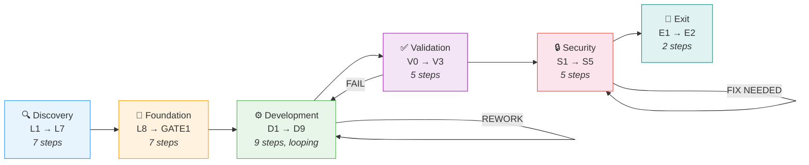
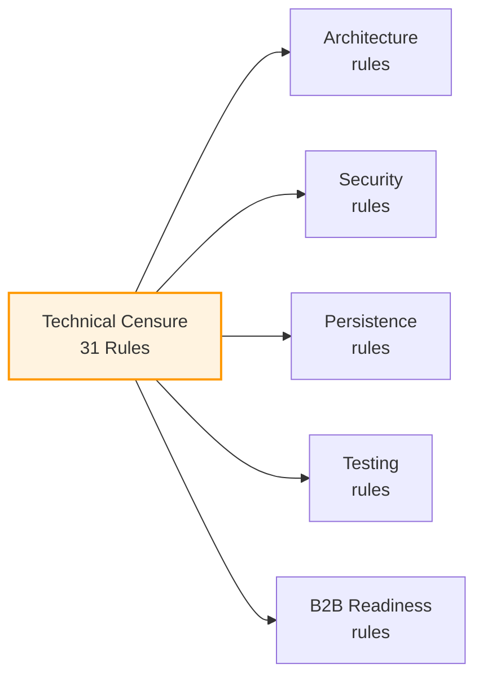
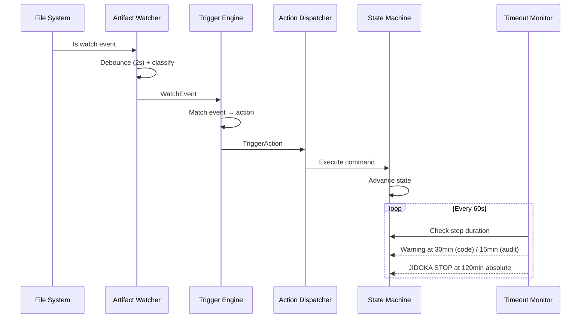
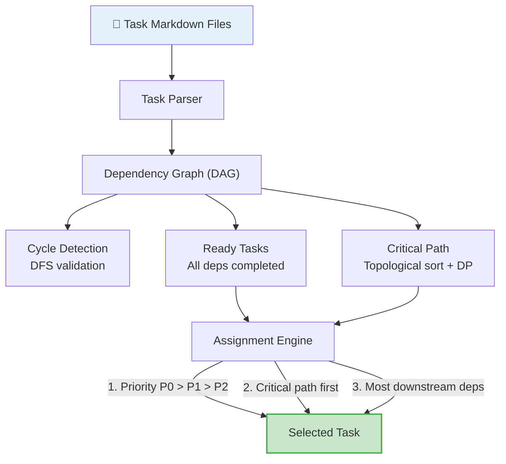

# Autonomous AI Product Development Orchestrator

> A structured state-machine that drives AI coding agents through a complete product lifecycle — from discovery to production — with built-in quality gates, hallucination control, and zero human babysitting.

---

## What This Does

Most AI coding agents work as chatbots: you ask, they answer, you fix, you ask again. This orchestrator turns an AI agent into a **disciplined engineering team** that follows a structured process autonomously.

It manages the entire product development lifecycle through **6 phases, 34 steps, and 3 independent quality systems** — producing production-ready software with minimal human intervention.

**Built with:** TypeScript · Zero external dependencies · Native `fs.watch` · JSON state machine

---

## Architecture Overview



---

## Lifecycle Phases

The orchestrator drives an AI agent through 6 sequential blocks. Each block contains steps that execute autonomously until a human gate decision is required.



### Phase Details

| Phase | Steps | What Happens |
|-------|-------|-------------|
| **Discovery** | L1 → L7 | Observe existing state, build project description, design spec, behavior spec. Agent acts as Researcher + Architect. |
| **Foundation** | L8 → GATE1 | Create development plan, scan with Technical Censure (31 rules), decompose into task DAG, allocate priorities. Human gate decides GO / REBUILD / KILL. |
| **Development** | D1 → D9 | Iterative task execution loop. Each cycle: plan scan → task assignment → code → audit → HANSEI reflection → mini-gate decision. Auto-loops until all tasks DONE. |
| **Validation** | V0 → V3 | Full-product smoke test, acceptance review, deep validation, HANSEI reflection with validation conclusions. Can send back to Development on FAIL. |
| **Security** | S1 → S5 | Docker security scan, issue triage, fix implementation, verification, human sign-off. Auto-loops if new issues found. |
| **Exit** | E1 → E2 | Final deployment, project completion. Terminal state. |

---

## Quality Systems

Three independent mechanisms prevent the AI from going off-track:

### 1. POKA-YOKE (Error Prevention)

Every step has preconditions that must pass before execution begins. 7 check types ensure the system is in the correct state:

| Check Type | What It Validates |
|-----------|-------------------|
| `file_exists` | Required artifact files are present |
| `dir_empty` | Clean workspace before generation |
| `dir_not_empty` | Previous work exists to build upon |
| `artifact_registered` | State tracks the required artifact |
| `artifact_null` | No stale artifacts from previous cycles |
| `step_completed` | Prerequisite steps have been done |
| `state_field` | State values match expected conditions |

### 2. JIDOKA (Stop-the-Line)

Active during task execution steps (L10, D5). Halts all work immediately if any of 5 criteria are met:

```
J1 — Output blocks downstream tasks
J2 — Output contradicts product specification  
J3 — Data integrity or security compromised
J4 — 3+ consecutive failures with same root cause
J5 — Output contradicts plan or standards
```

On JIDOKA STOP: creates an issue, blocks the pipeline, collects diagnostic metrics. Requires explicit unblock.

### 3. Technical Censure (31 Rules)

Applied to plans and tasks at steps L8, L9, D3, D4. Five categories:



Includes **sycophancy protection**: if the first pass returns all-PASS, the system forces a re-check to prevent the AI from rubber-stamping its own work.

---

## Daemon System

The daemon runs as a background process, watching for file changes and driving the orchestrator automatically:



### Event Classification

| Event Type | Trigger | Action |
|-----------|---------|--------|
| `artifact_created` | File matching expected artifact appears | `complete --artifact <path>` |
| `gate_decision_created` | Gate decision file written | `decide --decision <parsed>` |
| `code_changed` | Source code modified during D5/L10/S3 | Run code health check |
| `task_created` | New task markdown added | Update task count |
| `state_changed` | state.json modified externally | Reload state |

### Safety Features

- **Lock files** prevent race conditions during daemon writes
- **Retry Controller**: auto-retries failed actions up to 3x, creates issue on persistent failure
- **Step Watchdog**: detects anomalies (10x normal duration)
- **Timeout escalation**: warning → reminder → JIDOKA STOP (120min absolute limit)

---

## Task Queue System

Tasks are defined as markdown files, parsed into a dependency DAG, and assigned by priority:



Single-worker model: exactly one task in-progress at a time. Prevents context-switching overhead in AI agents.

---

## Auto-Gate Intelligence

The D9 (mini-gate) evaluates progress automatically with **cycle-phase awareness**:

| Cycle Phase | Cycles | Auto-VALIDATE Threshold |
|------------|--------|------------------------|
| Early | 1-3 | 90% tasks completed |
| Mid | 4-6 | 80% tasks completed |
| Late | 7+ | 75% tasks completed |

Hard limits: max 15 development cycles, max 3 security fix cycles. Stagnation detection (no progress over 2 cycles) triggers escalation.

GATE1 supports **auto-GO**: if all P0 acceptance criteria pass with zero mismatches, skips human review.

---

## Learning & Metrics

Every significant event is recorded to `metrics.jsonl`:

| Event | Data Captured |
|-------|--------------|
| Step completion | Duration, block, step, cycle |
| Step failure | Error type, step, context |
| Gate decision | Decision value, auto vs human, cycle |
| JIDOKA stop | Criteria triggered, step, task |
| Code health check | Pass/fail, error count |
| Precondition failure | Which checks failed, step |
| Cycle transition | New cycle number, tasks status |

Used for: cycle duration trends, failure hotspot analysis, efficiency tracking across development iterations.

---

## Project Structure

```
control_center_code/
├── src/
│   ├── orchestrator.ts          # CLI entry point (9 commands)
│   ├── state-machine.ts         # State transitions + persistence
│   ├── daemon.ts                # Autonomous daemon process
│   ├── step-registry.ts         # 34 step definitions
│   ├── commands/                # CLI command handlers
│   ├── types/                   # TypeScript type system
│   │   ├── base.ts              # Block, Step, Status, ArtifactRegistry
│   │   ├── state.ts             # SystemState (30+ fields)
│   │   └── steps.ts             # StepDefinition, PreconditionCheck
│   ├── watcher/                 # Daemon subsystems
│   │   ├── artifact-watcher.ts  # fs.watch recursive + event classification
│   │   ├── trigger-engine.ts    # Event → Action mapping
│   │   └── timeout-monitor.ts   # Step duration enforcement
│   ├── gates/
│   │   └── auto-gate.ts         # Cycle-phase-aware auto-decisions
│   ├── validators/
│   │   ├── preconditions.ts     # POKA-YOKE (7 check types)
│   │   ├── jidoka.ts            # Stop-the-line (5 criteria)
│   │   └── technical-censure.ts # 31-rule plan/task validator
│   ├── queue/
│   │   ├── assignment-engine.ts # Priority + critical path selection
│   │   └── dependency-resolver.ts # DAG ops + cycle detection
│   ├── learning/
│   │   └── metrics-collector.ts # 7 event collection hooks
│   └── steps/                   # Step implementations (25 files)
└── tests/                       # 9 test suites
    ├── core-tests.ts            # State machine + transitions
    ├── daemon-tests.ts          # Daemon lifecycle
    ├── queue-tests.ts           # Queue operations
    ├── structural-tests.ts      # Code structure validation
    ├── metrics-tests.ts         # Metrics collection
    ├── b2b-censure-tests.ts     # Technical censure rules
    ├── b2b-detection-tests.ts   # B2B pattern detection
    └── simulation.ts            # Full lifecycle simulation
```

---

## Design Decisions — Problems Solved

Every mechanism exists because a real problem was encountered. Here's the engineering thinking behind the key decisions:

### State Persistence & Crash Recovery

> **Problem:** `state.json` is the single source of truth. A crash mid-write corrupts it — the system bricks, all progress lost.  
> **Decision:** Auto-backup (`state.json.bak`) before every write via `fs.copyFileSync`. 3-tier recovery: main file → `.bak` → `STATE_CORRUPTED` escalation. `isValidState()` validates required fields + enum values before accepting any state.  
> **Result:** Single-failure recovery with zero dependencies. Half-written JSON is rejected, not silently accepted.

### Self-Ignore Lock (Infinite Loop Prevention)

> **Problem:** Daemon runs `complete` → writes `state.json` → watcher sees change → fires `reload_state` → daemon writes again → infinite loop.  
> **Decision:** `acquireLock()` before any CLI execution, `releaseLock()` after. Watcher checks `isLocked()` and skips all events when lock is active. Lock stored in `daemon_state.json` (survives across process boundary).  
> **Result:** Zero feedback loops while preserving real external state changes.

### 2-Second Debounce on File Events

> **Problem:** A single file save triggers 2-3 `fs.watch` events (write, rename, metadata). Without debounce, daemon fires `complete` multiple times for one artifact.  
> **Decision:** Per-file `Map<string, NodeJS.Timeout>` with 2-second cooldown. Each new event for the same path resets the timer.  
> **Result:** One action per real file operation. 2s is long enough for editor write-rename-cleanup, short enough to feel responsive.

### Hardened Gate Decision Parser (OPT-12)

> **Problem:** Gate decision files are Markdown written by LLMs. A naive regex could extract garbage text as a "decision" and cause undefined state transitions. Ukrainian headers and extra formatting fool simple parsers.  
> **Decision:** Two-strategy parsing (structured block + line-level fallback), then candidate uppercased and stripped of non-alpha chars, then validated against `VALID_DECISIONS` whitelist. Supports `## Decision` and `## Рішення` (Ukrainian).  
> **Result:** Even if regex matches garbage, the whitelist rejects anything that isn't a valid transition. Zero invalid gate decisions.

### Tiered Timeout System

> **Problem:** Code steps take 15-20 min, audit steps take 5-10 min, gate decisions can take hours. A single timeout fires too early on code steps or too late on audits.  
> **Decision:** Three tiers: code=30min, audit=15min, gate=60min. Plus 120min absolute limit → JIDOKA STOP. Per-step overrides (D5: 60min, D2: 20min). `warnedSteps` Set prevents warning spam.  
> **Result:** Early signals without false positives. 120min ceiling guarantees the system never hangs indefinitely.

### `step_started_at` vs `last_updated` (OPT-4)

> **Problem:** `last_updated` resets on any state write (artifact registration, status change). A step running for 45 minutes shows only 2 minutes elapsed because state was written 2 minutes ago.  
> **Decision:** Added dedicated `step_started_at` timestamp, set only on step transitions in `advanceState()`. Watchdog uses this for timeout calculation.  
> **Result:** Accurate step duration tracking regardless of intermediate state writes.

### Single-Worker Task Queue

> **Problem:** AI agents operate as a single thread — they can only work on one task. Parallel assignment causes file conflicts, race conditions, and makes error tracking impossible.  
> **Decision:** `pickNextTask()` returns exactly ONE task. Sort: P0 > P1 > P2 → critical path first → most downstream dependents → alphabetical tiebreaker.  
> **Result:** Deterministic task selection. No context-switching overhead.

### Critical Path Prioritization

> **Problem:** Without it, the system picks an easy P1 task while a blocking P0 chain stalls. Downstream tasks queue forever.  
> **Decision:** `getCriticalPath()` via topological sort + dynamic programming. `countDownstream()` BFS counts transitive dependents. Used as secondary sort key.  
> **Result:** Tasks that unblock the most work are always prioritized.

### DAG Cycle Detection

> **Problem:** A cyclic dependency (A→B→A) deadlocks the queue — neither task becomes "ready." The system silently reports "no ready tasks" with no explanation.  
> **Decision:** DFS with `visited` + `inStack` sets. Returns the exact cycle path (e.g., `["B1", "C1", "B1"]`).  
> **Result:** Immediate detection with actionable info to fix the specific circular dependency.

### Anti-Sycophancy Double Check

> **Problem:** AI agents tend to say "everything looks good." If all 31 censure rules pass on first try, it's likely rubber-stamped.  
> **Decision:** `recheck_performed` flag — if all PASS on first pass, force a second check on blocks A (Architecture) + B (Security).  
> **Result:** Catches the "I agree with everything" failure mode on the two highest-risk categories.

### Retry Controller (MAX_RETRIES=3)

> **Problem:** Steps fail transiently (network timeout, file lock, temp compilation error). Without retry, every fluke stops the daemon. With unlimited retries, persistent errors loop forever.  
> **Decision:** Per-step retry counter, max 3. Success resets counter (prevents accumulation). Failure at 3 → JIDOKA STOP + auto-created issue in `issues/active/`.  
> **Result:** 3 retries handles transient failures. Auto-issue ensures every failure is documented. Per-step tracking prevents unrelated failures from interfering.

### Censure Block Tracker (OPT-10)

> **Problem:** Agent gets stuck: write plan → censure blocks on rule A3 → rewrite → blocks on A3 again → infinite loop.  
> **Decision:** Per-rule limit (3 blocks → escalation issue), total limit (5 → JIDOKA WARNING), `skip_suggestion` flag tells agent to stop trying the impossible fix.  
> **Result:** Catches when a specific rule is fundamentally unsatisfiable for this project.

### Circuit Breaker for D↔V Loops

> **Problem:** Development→Validation→FAIL→Development→Validation→FAIL loops indefinitely.  
> **Decision:** `MAX_VALIDATION_ATTEMPTS=3`. After 3 failures at V2 → auto-KILL at V3. D9 blocks auto-VALIDATE when circuit breaker fires.  
> **Result:** If validation fails 3 times, the project has fundamental issues requiring human judgment, not more iterations.

### Stagnation Detection (OPT-1 + OPT-22)

> **Problem:** Done% fluctuates 73→74→73→74. Small changes disguise real stagnation — the system auto-CONTINUEs forever.  
> **Decision:** `STAGNATION_RANGE=2` (percentage points). If change < ±2% across cycles, increment counter. After 2 consecutive stagnant cycles → escalate to human. Progress > 2% resets counter.  
> **Result:** Range-based detection prevents noise from masking stagnation. Guaranteed convergence.

### Hard Ceilings (OPT-22)

> **Problem:** Edge cases slip past stagnation detection (alternating 72%↔78% — enough progress to avoid stagnation flag but never reaching threshold).  
> **Decision:** Three absolute ceilings: 15 dev cycles, 3 validation attempts, 3 security fix cycles. Any ceiling → auto-KILL/STOP.  
> **Result:** Mathematical guarantee the system terminates. These are emergency brakes that should never fire in normal operation.

### Infrastructure vs Code Blocker Classification (OPT-6)

> **Problem:** Acceptance criteria marked PARTIAL because Docker/CI/CD isn't deployed yet — but all code is correct. Standard % metric penalizes infrastructure blockers, preventing VALIDATE at 98% done.  
> **Decision:** `parseGoalsDetailed()` classifies PARTIAL items as `partial_infra_count` vs `partial_code_count`. Code-complete ≥90% + zero code partials → auto-VALIDATE regardless of infra status.  
> **Result:** Prevents the "98% done but can't validate because Docker isn't configured" deadlock.

### Isolation Mode for Validation Block

> **Problem:** During validation (V0-V3), the agent must audit code, not modify it. Without isolation, agent "helpfully" refactors during V1 audit, invalidating the audit itself.  
> **Decision:** Boolean `isolation_mode` toggled on V0 entry, off on V3 exit. Checked by step instructions.  
> **Result:** Clean separation between "build" and "verify" phases.

### Artifact Rotation System

> **Problem:** Each development cycle produces artifacts (plans, reports). Without rotation, new cycle overwrites old → history lost, no comparison between cycles possible.  
> **Decision:** Three-step rotation: `prev_cycle → archive`, `current → prev_cycle`, `current → null`. Three rotation scopes: D1 (all 12 keys), V0 (4 V-keys only), S1 (2 S-keys only).  
> **Result:** Full artifact history preserved. V0 rotation preserves D-block artifacts so the validator can compare.

### Lifecycle Hooks Centralization

> **Problem:** Both `complete.ts` and `decide.ts` trigger the same transitions (D9 CONTINUE). Each needs rotation + cycle increment + isolation toggle. Duplicating logic = bugs when one path is updated.  
> **Decision:** `applyAllHooks()` runs all lifecycle hooks. Single source of truth called from both command handlers.  
> **Result:** Adding a new lifecycle behavior requires editing only `lifecycle-hooks.ts`.

### 13 Required Task Sections

> **Problem:** AI generates tasks with varying quality — sometimes missing acceptance criteria, sometimes missing validation scripts. The executing agent receives incomplete instructions and builds the wrong thing.  
> **Decision:** On D4/L9 complete, every task `.md` is scanned for 13 required `## ` headings (description, goal, expected result, steps, acceptance criteria, DoD, files, dependencies, tests, report, code context, prohibitions, validation script).  
> **Result:** Structural validation catches missing sections before execution. Content quality handled by Technical Censure.

### File System as Communication Protocol

> **Problem:** Building an API layer between daemon and agents adds complexity, versioning, and a network dependency.  
> **Decision:** Agents create files; the daemon detects them via `fs.watch`. `classifyEvent()` maps paths to event types: `audit/gate_decisions/` → `gate_decision_created`, `tasks/active/` → `task_created`, `server/` → `code_changed`.  
> **Result:** Any tool that creates a file in the right directory triggers the right action. No API layer needed.

### Cyrillic Command Protection

> **Problem:** AI agent frequently typed `сcd` (Cyrillic 'с') instead of `cd`, or used bash syntax on Windows.  
> **Decision:** `outputJSON()` injects an `environment` block with warnings into every CLI response: `"NEVER use 'cd'", "NEVER type 'ccd' or 'сcd'", "Use PowerShell syntax ONLY"`.  
> **Result:** Repetition in every response prevents command mistakes regardless of context window length.

### Non-Blocking Metrics (Iron Rule #5)

> **Problem:** If metrics file is locked/full/corrupted, the step transition must still succeed. Metrics collection crashing the orchestrator would be absurd.  
> **Decision:** Every metrics call wrapped in `try { collect...; } catch { /* non-blocking */ }`. 15+ instances across the codebase. Append-only JSONL format with lock timeout fallback.  
> **Result:** Observability never affects correctness. Slightly malformed metrics file > no metrics.

### Signal Poller for Headless Mode (OPT-17)

> **Problem:** System normally runs through VS Code extension. But when VS Code crashes or in CI/CD, there's no way to trigger agent sessions.  
> **Decision:** Polls `session_boundary.signal` file every 30s. `BRIDGE_GRACE_PERIOD_MS=5000` gives VS Code priority. Atomic lock creation via `O_CREAT|O_EXCL`. Stale lock detection at 5 minutes.  
> **Result:** File-based signaling works everywhere. No server dependency. Grace period prevents race between bridge and poller.

### Zero External Dependencies

> **Problem:** NPM supply chain attacks are a real risk. The orchestrator controls the entire development process — compromising it compromises everything it builds.  
> **Decision:** Zero npm packages in production. Only `ts-node` and `typescript` as dev dependencies. Everything built on Node.js built-ins (`fs`, `path`, `child_process`).  
> **Result:** Eliminated supply chain risk entirely. No `node_modules` in production.

---

## Proven Results

This orchestrator was used to build [BillingCore](https://github.com/globoohotron-rgb/billingcore) — a full SaaS billing platform (Fastify + Prisma + PostgreSQL + Redis + React) — from zero to production deployment in **12 hours** of autonomous operation.

---

## Quick Start

```bash
# Install
npm install

# Check system status
npm run status

# Get instructions for current step
npm run instructions

# Start autonomous daemon
npm run daemon:start

# Scan task queue
npm run queue:scan

# View metrics
npm run analyze:metrics
```

---

## CLI Commands

| Command | Description |
|---------|------------|
| `status` | Current state (block, step, cycle, artifacts) |
| `check` | Run POKA-YOKE preconditions for current step |
| `instructions` | Get full instructions for current step |
| `complete --artifact <path>` | Complete current step with artifact |
| `decide --decision <value>` | Submit gate decision |
| `daemon start\|stop\|status` | Manage autonomous daemon |
| `queue scan\|status\|next\|start\|done\|fail\|reset` | Task queue operations |
| `analyze metrics\|clear` | Metrics analysis |
| `report` | Generate cycle report |

---

## License

MIT
